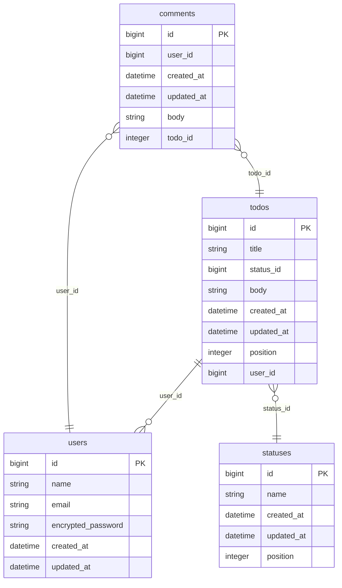

# 環境構築方法
```bash
git clone git@github.com:topi0247/live-coding-todo.git
docker compose build
docker compose run --rm web /bin/bash -c "bundle config set --local path vendor/bundle && bundle install"
docker compose up
```

## 注意
`rails`コマンドを使うときは、`bin/rails`で使うようにすること
例：`docker compose exec web bin/rails db:migrate:status`

## ダミーデータ
初期でダミーデータを入れる場合は下記
```bash
docker compose exec web bin/rails db:seed
```

### ダミーデータ使用時のログイン情報
下記でログイン可能
```
email: user1@example.com
password: password
```

# ER図
